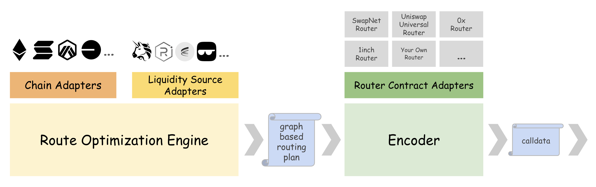

# Modularized architecture

<figure><figcaption></figcaption></figure>

## 🏗️ Technical Architecture

### **Core Components**

* **Optimization Engine**: Advanced algorithms for route optimization
* **Speed Layer**: Offchain processing for millisecond response times
* **Modular Framework**: Adaptable components for chain-specific requirements
* **Liquidity Aggregation**: Comprehensive pool and source management

### **API Features**

* RESTful API endpoints
* Real-time WebSocket connections
* Comprehensive documentation
* Developer-friendly integration tools

## 🎯 Use Cases

### **For Protocols**

* Custom liquidity management solutions
* Strategic liquidity preferences
* Enhanced ecosystem integration

### **For Developers**

* Wallet integration
* DEX functionality enhancement
* Trading application optimization

### **For Market Makers**

* Advanced routing strategies
* Multi-chain liquidity management
* Real-time price optimization
