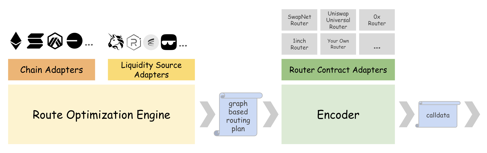

# Modularized Architecture

<figure><figcaption></figcaption></figure>

## Architecture Overview

### Core Flow

The heart of our system follows a clean, two-stage process:

1. **Route Optimization Engine**: Runs sophisticated optimization algorithms to analyze all available liquidity across sources on target chain, producing a **graph-based routing plan**. This plan serves as a complete, intermediate representation of the optimal route - chain-agnostic and router-agnostic.

2. **Encoder**: Takes the graph-based routing plan and encodes it into specific calldata targeting the user's specified router contract, handling the translation from our universal representation to the router's expected data.

### Adapter Architecture

Our system employs three types of adapters that decouple complex external integrations from our core engine:

- **Chain Adapters**: Handle blockchain-specific operations and data formates
- **Liquidity Source Adapters**: Manage integration with various DEXs, including AMMs and RFQs  
- **Router Contract Adapters**: Enable support for different execution contracts

These adapters isolate all the complicated integration logic with external resources and dependencies, keeping our core Route Optimization Engine simple, focused, and maintainable.

## Extensible and Customizable Services

This modularized architecture enables us to provide extensible and customizable routing services beyond regular trading:

### Easy Chain and Protocol Integration
- **New Chain Support**: Adding support for a new blockchain requires only implementing a new chain adapter without modifying the core optimization engine. With existing liquidity sources, new chain support typically takes only **30 minutes of development time**.
- **New Liquidity Sources**: Integrating additional DEXs, AMMs, or novel liquidity protocols is simplified through the adapter pattern. New liquidity source support normally takes just **a few hours of development time** if their contract is a fork of popular AMM contract templates.

### User Customization Options
- **Prioritize Preferred Liquidity**: Users can configure the system to prioritize their own liquidity sources or preferred protocols in the routing optimization
- **Custom Router Contracts**: Advanced users and institutions can deploy and use their own router contracts while still benefiting from our optimization engine
- **Flexible Execution**: The separation between route planning and execution allows users to choose their preferred execution method

### Benefits for Different User Types
- **Regular Traders**: Benefit from optimized routing across all available liquidity
- **Market Makers and Protocols**: Can customize routing to prioritize their own liquidity while maintaining control over execution
- **Solvers and Developers**: Can build on top of our optimization engine with their own execution layer

This architecture transforms traditional DEX aggregation from a one-size-fits-all solution into a flexible, modular platform that can adapt to diverse user needs and rapidly evolving DeFi landscape.
